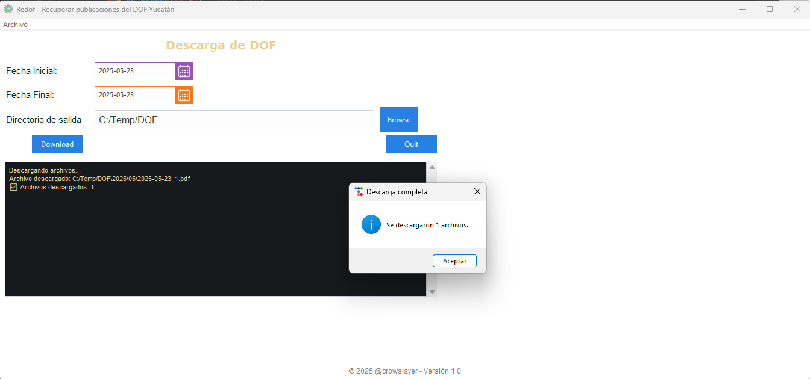
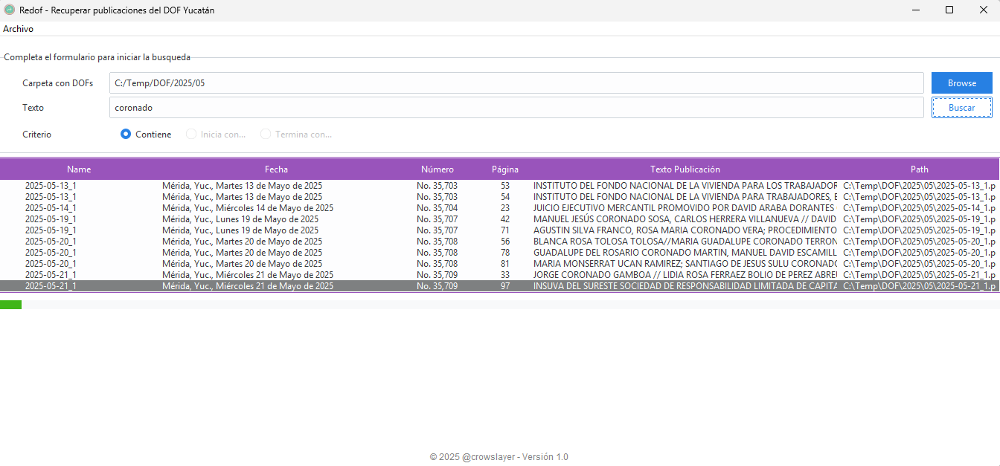
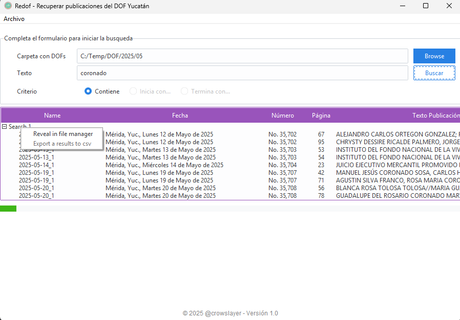
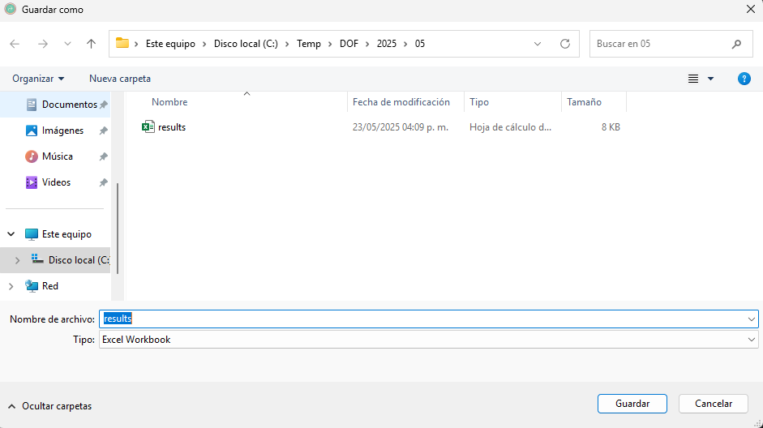
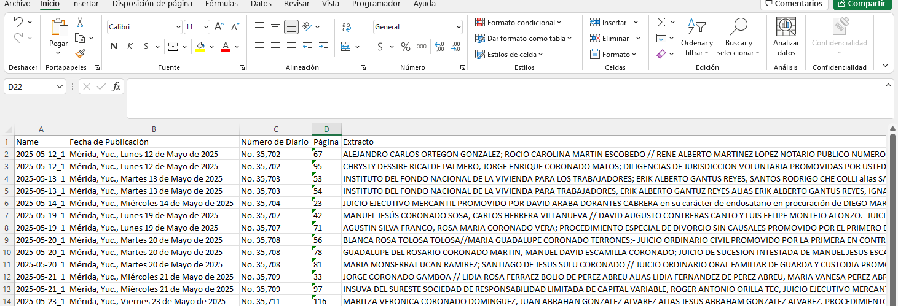

# Redof
### Routine to download files from the DOF Yucatán, in bulk, directly or via scraping.

## License

See the [LICENSE](LICENSE.md) file for license rights and limitations (MIT).

# Requirements.
- **request**
- **BeautifulSoup**

## Parameters

- **begin_date: Beginning date**
- **end_date: end date**
- **path: Directory path where the files will be downloaded.**

## How to use
Enter the date range for the logs to be retrieved, and the download path.
Upon completion, a window will appear with the number of files downloaded.

# DOF Reader
### Routine for searching for information or files in the official journal publications.

# Requirements.
- **Pymupdf**
- **Pandas**
- **openpyxl**

## How to use
To search, you must provide the path to the official gazette files in PDF format.

The program will display the results.

You have the option to export search results to an Excel file.
Simply right-click on the search and select the appropriate option.

### Export to Excel

Enjoy
@crowslayer
